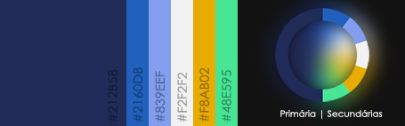
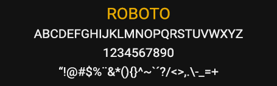

## Definições de Design

---

## Cores
Definir a paleta de cores do sistema torna o processo de padronização de estilos mais fácil e garante que haja elementos que gerem confusão ao usuário.

Deste modo, a paleta de cores do sistema deve se basear em:

**Principal:**

 #212B58

**Secundárias:**

 #2160DB
 #839EEF
 #F2F2F2
 #F8AB02
 #48E595

---
## Tipografia

Assim como a definição de cores, a padronização de tipografia, utilizando uma fonte legível, também garante um software mais limpo e de fácil compreensão.

Fica definida a fonte [Roboto](https://fonts.google.com/specimen/Roboto), sendo livre o uso de suas variações.

----

## Casos Omissos

Casos de uso de design que não estão descritos neste documento devem seguir o padrão [Material Design](https://m3.material.io/).