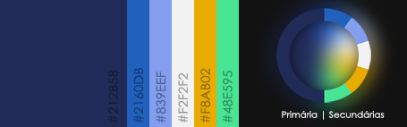
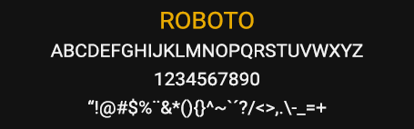

## Definições de Design

---

## Cores
Definir a paleta de cores do sistema torna o processo de padronização de estilos mais fácil e garante que haja elementos que gerem confusão ao usuário.

Deste modo, a paleta de cores do sistema deve se basear em:

**Principal:**

    <svg xmlns="http://www.w3.org/2000/svg" width="16" height="16" class="bi bi-square-fill" viewBox="0 0 16 16"> <path d="M0 2a2 2 0 0 1 2-2h12a2 2 0 0 1 2 2v12a2 2 0 0 1-2 2H2a2 2 555 0 1-2-2V2z" fill="#212b58"></path> </svg> #212B58

**Secundárias:**

    <svg xmlns="http://www.w3.org/2000/svg" width="16" height="16" class="bi bi-square-fill" viewBox="0 0 16 16"> <path d="M0 2a2 2 0 0 1 2-2h12a2 2 0 0 1 2 2v12a2 2 0 0 1-2 2H2a2 2 555 0 1-2-2V2z" fill="#2160DB"></path> </svg> #2160DB
    <svg xmlns="http://www.w3.org/2000/svg" width="16" height="16" class="bi bi-square-fill" viewBox="0 0 16 16"> <path d="M0 2a2 2 0 0 1 2-2h12a2 2 0 0 1 2 2v12a2 2 0 0 1-2 2H2a2 2 555 0 1-2-2V2z" fill="#839EEF"></path> </svg> #839EEF 
    <svg xmlns="http://www.w3.org/2000/svg" width="16" height="16" class="bi bi-square-fill" viewBox="0 0 16 16"> <path d="M0 2a2 2 0 0 1 2-2h12a2 2 0 0 1 2 2v12a2 2 0 0 1-2 2H2a2 2 555 0 1-2-2V2z" fill="#F2F2F2"></path> </svg> #F2F2F2 
    <svg xmlns="http://www.w3.org/2000/svg" width="16" height="16" class="bi bi-square-fill" viewBox="0 0 16 16"> <path d="M0 2a2 2 0 0 1 2-2h12a2 2 0 0 1 2 2v12a2 2 0 0 1-2 2H2a2 2 555 0 1-2-2V2z" fill="#F8AB02"></path> </svg> #F8AB02
    <svg xmlns="http://www.w3.org/2000/svg" width="16" height="16" class="bi bi-square-fill" viewBox="0 0 16 16"> <path d="M0 2a2 2 0 0 1 2-2h12a2 2 0 0 1 2 2v12a2 2 0 0 1-2 2H2a2 2 555 0 1-2-2V2z" fill="#48E595"></path> </svg> #48E595

---
## Tipografia

Assim como a definição de cores, a padronização de tipografia, utilizando uma fonte legível, também garante um software mais limpo e de fácil compreensão.

Fica definida a fonte [Roboto](https://fonts.google.com/specimen/Roboto), sendo livre o uso de suas variações.

----

## Casos Omissos

Casos de uso de design que não estão descritos neste documento devem seguir o padrão [Material Design](https://m3.material.io/).